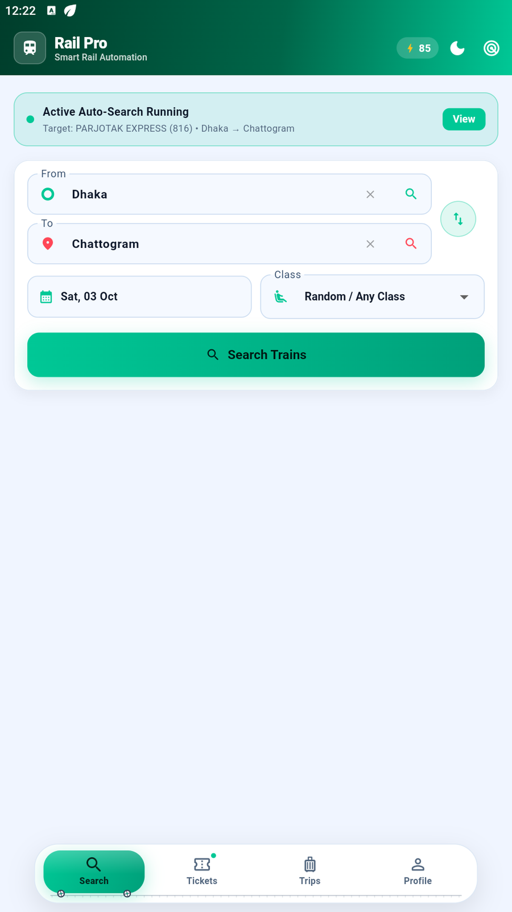
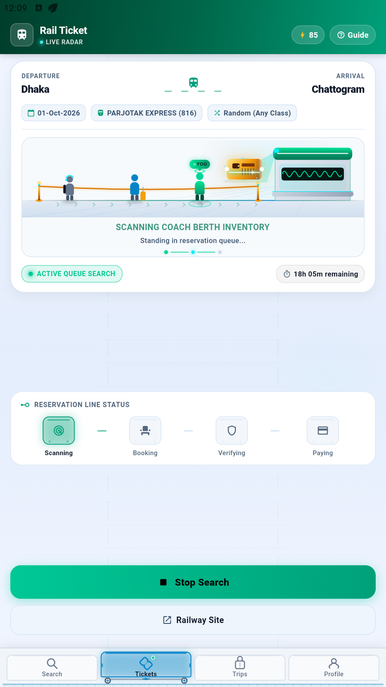
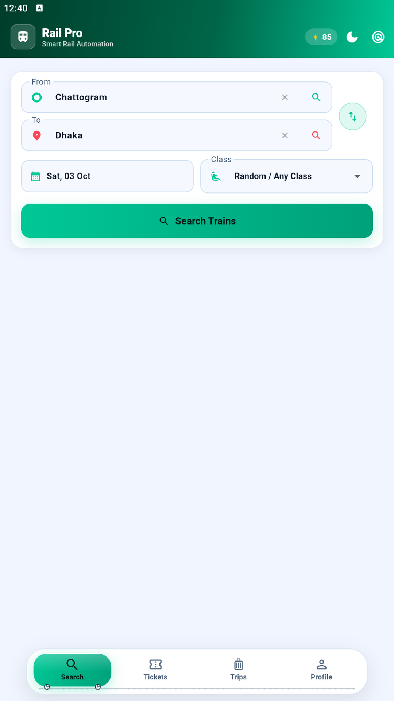

<div align="center">

  

  # Rail Pro (বাংলাদেশ রেলওয়ে অটোমেশন)
  ### Smart Bangladesh Railway Ticket Monitoring & Auto-Reservation Assistant

  [](https://github.com/about-shihab/rail_automation/releases)
  [](https://github.com/about-shihab/rail_automation)
  [](https://flutter.dev)
  [](test/)
  [](https://about-shihab.github.io/rail_automation/)

  <p align="center">
    <strong>Never miss an open train seat again.</strong> Continuous route monitoring, multi-train selection, multi-coach seat booking, and secure Google SMS Retriever OTP verification for Bangladesh Railway.
  </p>

  <p align="center">
    <a href="https://about-shihab.github.io/rail_automation/"><strong>🌐 Visit Official App Website »</strong></a>
    &nbsp;•&nbsp;
    <a href="#-direct-apk-download"><strong>📥 Download APK »</strong></a>
    &nbsp;•&nbsp;
    <a href="PRIVACY_POLICY.md"><strong>📄 Privacy Policy »</strong></a>
  </p>

</div>

---

## 📸 App Preview

| Ticket Search & Radar | Queue Waiting Room | Multi-Coach Seat Layout |
|:---:|:---:|:---:|
|  |  |  |
| *256 Canonical stations with class filters* | *Intelligent waiting room queue handling* | *Select up to 4 seats across different coaches* |

---

## ⚡ Key Features

* 🚆 **Multi-Train Auto-Booking**: Bangladesh Railway returns multiple trains per route in a single API call. Monitor and auto-book across multiple target trains (e.g. *Subarna Express*, *Sonar Bangla Express*, *Mohanagar Provati*) without interrupting or resetting your route.
* 💺 **Multi-Coach Seat Flexibility**: Auto-book up to 4 tickets across any coaches on the train. You are no longer restricted to a single coach when seats are scattered.
* ⏱️ **Departure-Time Monitoring**: No artificial 60-minute cutoff. Monitoring searches non-stop until the train's scheduled departure time.
* 📲 **Google SMS Retriever API**: Auto-detects official Railway OTP verification codes securely without requiring dangerous SMS-reading permissions.
* 💳 **Dynamic Cloud Credit System**: Firestore database integration dynamically syncs credit packages in real-time. Exactly **1 credit** is deducted per auto-book reservation when seat hold & OTP are triggered.
* 🌓 **Dark Mode & Bilingual**: Sleek, battery-friendly dark theme with one-tap switching between Bangla (বাংলা) and English.
* 🔒 **Hardware-Backed Security**: Hardware keystore storage for action tokens and session data. Direct HTTPS connection to official Bangladesh Railway portal.

---

## 📥 Direct APK Download

| File | Version | Architecture | Minimum Android | Download Link |
| :--- | :---: | :---: | :---: | :--- |
| `app-release.apk` | **v1.0.0** | `universal` (arm64, armeabi-v7a, x86_64) | Android 5.0 (API 21+) | [**Download APK**](https://github.com/about-shihab/rail_automation/releases/latest) |

---

## 🛠️ Project Structure

```text
rail_automation/
├── android/                  # Android native project & release signing configs
├── assets/                   # App icons and audio sound cues
├── docs/                     # GitHub Pages app website (index.html & assets)
├── lib/
│   ├── models/               # Data models (TrainTrip, SeatType, BookingIntent, CreditPackage)
│   ├── services/             # Core engines (BookingService, MonitorService, CreditService, SmsService)
│   ├── utils/                # Design system tokens (AppColors, AppCard, Typography)
│   ├── views/                # Screens (SearchScreen, AppShell, SeatBookingScreen, MonitorDashboard)
│   └── widgets/              # Reusable components (TrainNavigationBar, TurnstileSheet)
├── test/                     # 54 Automated unit and widget tests
└── PRIVACY_POLICY.md         # Store-compliant privacy policy
```

---

## 🚀 Building & Running Locally

### Prerequisites
* Flutter SDK (3.13.1+)
* Android SDK / Android Studio
* Connected Android Device or Emulator

### Commands
```bash
# Get dependencies
flutter pub get

# Run test suite
flutter test

# Run in debug mode
flutter run

# Build signed production release APK
flutter build apk --release
```

---

## 👨‍💻 Developer Information

* **Lead Developer & Creator**: **Abdulla Al Mamun**
* **Email**: [`connect.abdulla@gmail.com`](mailto:connect.abdulla@gmail.com)
* **GitHub**: [@about-shihab](https://github.com/about-shihab)

---

## 🛡️ Official Disclaimer

> **Disclaimer**: Rail Pro is an independent automation and train ticket monitoring utility designed to assist users with personal ticket availability search and booking on the Bangladesh Railway portal.
>
> This application is **not affiliated with, endorsed by, or operated by Bangladesh Railway (BR)** or Shohoz-Synesis-Vincen JV. All ticket reservations, fares, OTPs, and seat allocations are processed directly through the official railway ticketing portal (`eticket.railway.gov.bd`).
